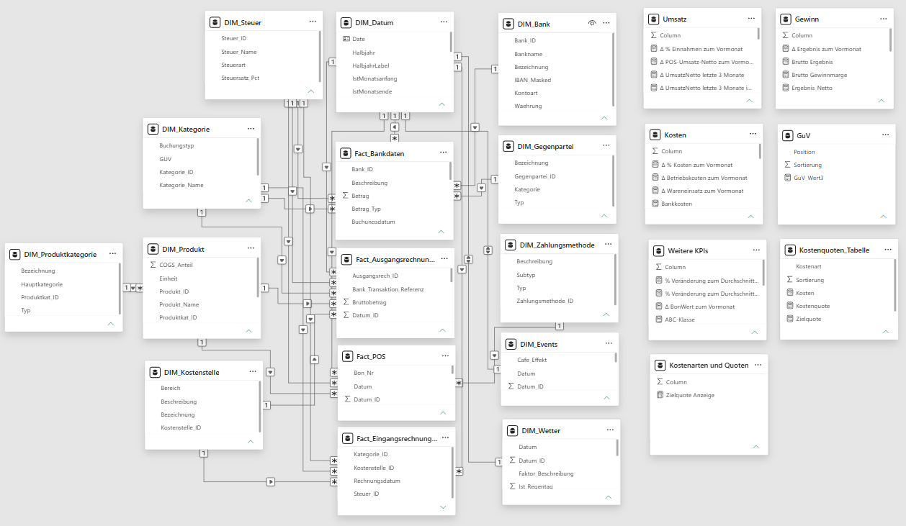

# Café-Controlling – Power BI Projekt

## 1. Einführung

Dieses Projekt umfasst ein **Power BI Cockpit** zur wirtschaftlichen Steuerung eines **Cafés**.

Ziel ist es, eine schnelle und transparente Übersicht über die **wirtschaftliche Entwicklung eines gastronomischen Kleinbetriebs** zu ermöglichen, von den Tageseinnahmen der Kasse bis zur Gewinn- und Verlustrechnung. Der Bericht umfasst folgende Analysebereiche:

- **Überblick** - Gesamtkennzahlen zu Einnahmen, Ausgaben, Ergebnis und Zielerreichung
- **Umsatz** - Entwicklung von Netto-Umsatz und Netto-Kosten im Zeitverlauf
- **Umsatztreiber** - Einfluss von Wochentag, Uhrzeit, Wetter und lokalen Events auf den Tagesumsatz
- **Produkte** - Verkaufsanalyse und ABC-Klassifizierung einzelner Produkte
- **Umsatzentwicklung (Produkte)** - Entwicklung des Produktumsatzes im Jahresverlauf
- **Finanzen** - GuV-Struktur, kumuliertes Ergebnis, Liquiditätsreichweite und offene Rechnungen
- **Kosten** - Kostenquoten im Soll-Ist-Vergleich zu Wareneinsatz, Personal und Betrieb
- **Kostenentwicklung (Kategorie)** - Entwicklung der Ausgaben nach Kostenkategorie

Datenbasis ist ein vollständiges Geschäftsjahr (2024) mit rund 45.300 Bons (ca. 73.500 Positionszeilen) aus dem Kassensystem sowie ergänzenden Bank-, Rechnungs- und Stammdaten. Dadurch wird eine fundierte Entscheidungsgrundlage für die Steuerung eines gastronomischen Betriebs geschaffen.

*(Screenshot für erste Berichtsseite "Überblick". Erläuterung der Berichtsseite unter 3.)*

## 2. Dashboard Übersicht

Das Dashboard bietet eine **zentrale Übersicht** über die wirtschaftliche Performance eines Cafés, von Gesamtkennzahlen bis zur Analyse einzelner Produkte, Kostenarten und Umsatztreiber. Es verbindet Zeitreihen, Produktvergleiche und Einzeltransaktionen aus Kasse, Bank und Rechnungen in einem einheitlichen Reporting.

Alle Ansichten können über einen gemeinsamen **Monats-/Jahres-Filter** eingegrenzt werden; eine eigene Navigationsleiste führt zwischen den Berichtsseiten.

Durch die Konsolidierung von **Kassen- (POS-), Bank-, Rechnungs- und Stammdaten** entsteht ein **automatisiertes** Controlling-Instrument, das Umsatztreiber, Kostenquoten und Liquiditätsentwicklung transparent macht.

## 3. Dashboard Seiten

**Überblick**

*(Screenshot oben bereits gezeigt, kein zweites Bild nötig)*

Diese Seite bildet den **wirtschaftlichen Gesamtüberblick** des Cafés ab.

- Wie hoch sind Einnahmen, Ausgaben und Ergebnis im aktuellen Zeitraum?
- Wie haben sich Einnahmen und Ausgaben über die Monate entwickelt?
- Wie viele Bons wurden im Zeitverlauf erzielt?
- Wie verteilt sich der Umsatz auf die Produkt-Hauptkategorien?
- Wie nah liegt das Ergebnis am definierten Zielwert?

**Umsatz**

Diese Seite stellt **Netto-Umsatz und Netto-Kosten** gegenüber und zeigt zentrale Tageskennzahlen.

- Wie entwickeln sich Umsatz und Kosten im Monatsverlauf?
- Wie hoch ist der durchschnittliche Bon-Wert?
- Wie hoch ist der durchschnittliche Tagesumsatz?

**Umsatztreiber**

Diese Seite analysiert die **Einflussfaktoren auf den Tagesumsatz**.

- Zu welchen Wochentagen und Uhrzeiten wird der meiste Umsatz erzielt?
- Wie stark weicht der Tagesumsatz je nach Wetterlage vom Durchschnitt ab?
- Welchen Mehrumsatz erzeugen lokale Events (z. B. Hamburg Marathon, Weihnachtsmarkt) gegenüber einem durchschnittlichen Tag?

**Produkte**

Diese Seite untersucht die **Wirtschaftlichkeit der einzelnen Produkte**.

- Welche Produkte gehören zur A-, B- oder C-Kategorie nach Umsatzanteil?
- Wie hat sich der Umsatz je Produkt zum Vormonat verändert?
- Wie viele Einheiten wurden je Produkt verkauft?

**Umsatzentwicklung (Produkte)**

Diese Seite ergänzt die Produktanalyse um die **zeitliche Entwicklung** je Produkt.

- Wie entwickelt sich der Umsatz einzelner Produkte über die Monate?
- Welche Produkte gewinnen, welche verlieren im Jahresverlauf an Bedeutung?

**Finanzen**

Diese Seite bildet die **betriebswirtschaftliche Gesamtsicht** inklusive GuV und Liquidität ab.

- Wie hat sich der Gewinn über die Monate entwickelt?
- Wie hoch ist das kumulierte Ergebnis im Jahresverlauf?
- Wie stellt sich die Gewinn- und Verlustrechnung nach Kategorien dar?
- Wie viele Monate reicht die Liquidität rechnerisch aus?
- Wie hoch sind offene Ausgangs- und Eingangsrechnungen?

**Kosten**

Diese Seite vergleicht **Ist- und Zielkostenquoten** je Kostenart.

- Wie hoch sind Wareneinsatz, Personal- und Betriebskosten im Verhältnis zum Umsatz?
- Liegen die Kostenquoten über oder unter der definierten Zielquote?
- Wie hat sich die Kostenquote im Zeitverlauf inklusive Warnschwelle entwickelt?
- Wie verteilen sich die Gesamtkosten auf Wareneinsatz, Personal und Betrieb?

**Kostenentwicklung (Kategorie)**

Diese Seite zeigt die **Ausgabenentwicklung je Kategorie** über mehrere Jahre.

- Wie entwickeln sich die Ausgaben einzelner Kategorien über die Zeit?
- Welche Kategorien verursachen saisonale Schwankungen?

## 4. Skills Showcase

Dieses Projekt demonstriert den praxisorientierten Einsatz folgender **Technologien und Fähigkeiten**:

- Power BI, Excel, GitHub
- Datenmodellierung (Star-Schema-Design mit Snowflake-Erweiterung Produkt → Produktkategorie)
- Data Cleaning und Datenaufbereitung (Power Query): Typkonvertierung, Bereinigung von Sonderzeichen in Zahlenfeldern, abgeleitete Spalten (z. B. Uhrzeit auf volle Stunde gerundet)
- Data Visualization
- Interaktive Filter / Slicer zur seitenübergreifenden Eingrenzung der Analysen
- Business Analysis im Gastronomie-/Cafékontext: Wetter- und Eventeinfluss auf den Tagesumsatz, ABC-Analyse, Liquiditätsreichweite
- Datumstabelle (vollständig DAX-generiert, 17 Zeit-Attribute)
- KPI-Erstellung DAX:
  - CALCULATE()
  - FILTER() / ALLSELECTED()
  - SUMX() / AVERAGEX()
  - DIVIDE()
  - SWITCH() / SELECTEDVALUE()
  - VAR / RETURN
  - DATESBETWEEN() / DATESINPERIOD()
  - REMOVEFILTERS() / ISINSCOPE()
- Zeilen - und Filterkontext
- Berichtsdokumentation
- Strukturierung von 85 Measures in themenbezogenen Tabellen (Umsatz-, Kosten-, Gewinn- und Kostenquoten-Kennzahlen)

## 5. Datenmodell

Das Datenmodell folgt einem **Star-Schema** und trennt **Fakten- von Dimensionsdaten**; die Produkthierarchie ist zusätzlich um eine **Snowflake-Stufe** erweitert.

Die zentralen **Faktentabellen** sind:
- FACT_POS (Kassenbons-Einzelpositionen mit Produkt, Menge, Preis, Zahlungsart, Tisch-Nr. und To-Go-Kennzeichen; rund 73.500 Positionszeilen / 45.300 Bons für 2024)
- FACT_Bankdaten (Kontobewegungen mit Betrag, Betragstyp, Kategorie, Gegenpartei und Zahlungsmethode)
- FACT_Ausgangsrechnungen (gestellte Rechnungen, z. B. für Catering-/Event-Aufträge)
- FACT_Eingangsrechnungen (Eingangsrechnungen von Lieferanten und Dienstleistern)

Diesen sind folgende **Dimensionstabellen** zugeordnet:
- DIM_Datum (vollständig DAX-generierte Zeitdimension mit Jahr, Quartal, Kalenderwoche, Wochentag, Halbjahr u. a.)
- DIM_Produkt → DIM_Produktkategorie (Sortiment: 28 Produkte in 6 Hauptkategorien, z. B. Heißgetränke, Kaltgetränke, Backwaren)
- DIM_Kategorie (Buchungs- und Kostenkategorien inkl. GuV-Zuordnung)
- DIM_Kostenstelle, DIM_Steuer, DIM_Zahlungsmethode und DIM_Gegenpartei (Kunden, Lieferanten, Vermieter, Behörden)
- DIM_Bank
- DIM_Wetter und DIM_Events (Tageswetter bzw. lokale Hamburger Veranstaltungen inkl. modelliertem Umsatzeinfluss) – beide 1:1 bidirektional mit Dim_Datum verknüpft, da je Kalendertag genau eine Zeile vorliegt

Ergänzend bündeln sieben themenbezogene **Measure-Tabellen** (Umsatz, Kosten, Gewinn, Weitere KPIs, GuV, Kostenquoten, Kostenarten, etc) insgesamt **85 DAX-Measures**, losgelöst von den reinen Datentabellen.

## 6. Abschluss

Dieses Projekt zeigt, wie ein vollständiges **Café-Controlling-Cockpit mit Power BI** aufgebaut wird, von der Datenmodellierung über die Berechnung betriebswirtschaftlicher Kennzahlen bis zur verständlichen Visualisierung von Umsatztreibern, Kostenquoten und Liquidität.

Im Mittelpunkt steht der **Business Value**: Eine konsolidierte, jederzeit abrufbare Entscheidungsgrundlage für die Steuerung eines gastronomischen Kleinbetriebs, die Transparenz über Umsatztreiber, Kostenstruktur und Zahlungsfähigkeit schafft.

## 7. Hinweis zum Projekt

Die in diesem Dashboard dargestellten Daten sind vollständig **synthetisch** und wurden ausschließlich zu Demonstrations- und Portfoliozwecken erstellt.

Café, Transaktionen, Finanzzahlen und Lieferanten sind frei erfunden. Für die Kalenderplausibilität wurden Namen real wiederkehrender Hamburger Veranstaltungen (z. B. Hamburg Marathon, Reeperbahn Festival) als zeitliche Anker verwendet; die daraus abgeleiteten Umsatzeffekte sind jedoch modellierte Schätzwerte ohne Bezug zu realen Geschäftszahlen.

Es werden **keine realen Personen-, Kunden- oder Unternehmensdaten** verarbeitet, gespeichert oder dargestellt. Ein Bezug zu einem tatsächlich existierenden Café oder Unternehmen ist weder beabsichtigt noch gegeben.
